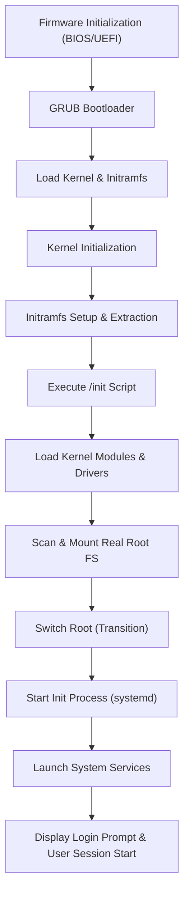

# Linux Boot Process Detailed Overview

The Linux boot process is a multi-step sequence that transforms a powered-off machine into a fully operational system. Below, each stage is described in detail—with a deep dive into the **initramfs**—and a diagram is provided to visualize the process.

---

## 1. Firmware Initialization (BIOS/UEFI)

- **Purpose:**  
  At power-on, the firmware (BIOS for older systems or UEFI for modern ones) conducts a Power-On Self Test (POST) to ensure hardware components are functioning properly.
  
- **Key Tasks:**  
  - Initialize essential hardware components.
  - Configure basic system settings.
  - Locate the boot device that contains the bootloader.
  
- **Outcome:**  
  Control is handed off to the bootloader that resides on the designated storage device.

---

## 2. GRUB Bootloader Details and Storage

- **Storage on Disk:**  
  - **BIOS-based Systems:**  
    GRUB is typically installed in the Master Boot Record (MBR) or in a dedicated boot sector. A small amount of code in the MBR points to the remainder of GRUB stored in a partition (usually within `/boot`).
  - **UEFI-based Systems:**  
    GRUB is provided as an EFI executable stored on the EFI System Partition (ESP). The UEFI firmware loads this executable directly.

- **Role of GRUB:**  
  - **Configuration File:**  
    GRUB reads its configuration file (commonly found at `/boot/grub/grub.cfg`), which lists available Linux kernel images, boot parameters, and the location of the initramfs.
  - **Kernel & Initramfs Loading:**  
    Once a kernel is selected (either manually by the user or automatically by GRUB), GRUB loads the chosen kernel image along with the associated initramfs image into memory.

---

## 3. Kernel and Deep Dive into Initramfs

### Linux Kernel Initialization

- **Primary Tasks:**
  - **Hardware Discovery:**  
    The kernel detects and initializes hardware components.
  - **Driver and Module Loading:**  
    It loads drivers and kernel modules needed to interact with the hardware.
  - **Memory & Process Setup:**  
    Essential data structures for memory management and process scheduling are built.

### In-Depth: Initramfs

- **Definition:**  
  Initramfs (initial RAM filesystem) is a compressed archive embedded with a minimal filesystem image. It is loaded into RAM along with the kernel.

- **Purpose & Tasks:**
  1. **Early Environment Setup:**  
     - Provides a temporary root filesystem.
     - Contains essential binaries, scripts (usually an `/init` script), and drivers needed to initialize hardware such as storage controllers.
  2. **Loading Kernel Modules:**  
     - Detects and loads modules required for the disk controller, filesystem drivers, and any other hardware needed to access the actual root filesystem.
  3. **Mounting the Real Root Filesystem:**  
     - Scans available devices to locate the storage device that holds the permanent root filesystem (like ext4, XFS, etc.).
     - Once identified, the initramfs mounts this filesystem.
  4. **Switch Root:**  
     - Executes a pivotal transition where the temporary environment is replaced by the real root filesystem.  
     - The process typically involves executing a `switch_root` command or equivalent, which hands over control from the initramfs to the main system environment.

- **Sequence in Initramfs:**  
  1. **Extract Initramfs:**  
     The kernel unpacks the compressed initramfs archive into a temporary filesystem (often a RAM-based `tmpfs`).
  2. **Execute `/init` Script:**  
     This script is the entry point. It configures the environment, loads necessary modules, and prepares for the upcoming switch.
  3. **Scan for the Real Root:**  
     The script inspects the hardware, waits for storage devices to be ready, and mounts the permanent root filesystem.
  4. **Transition:**  
     The final step replaces (or “switches”) the temporary initramfs with the real root environment. Once complete, the kernel drops the initramfs and continues the boot process using the mounted root filesystem.

---

## 4. Mounting the Root Filesystem

- **Process:**  
  After the successful tasks in the initramfs, the script mounts the root filesystem from the identified device and uses the `switch_root` mechanism to change from the temporary filesystem to the permanent one.
  
- **Result:**  
  This establishes access to the full set of files and configurations necessary for the complete system operation.

---

## 5. Starting the Init Process (systemd or Alternative)

- **Launch of PID 1:**  
  Once the root filesystem is active, the kernel starts the first user-space process — traditionally known as `init` (or `systemd` in many modern distributions).

- **Responsibilities:**  
  - **Service Management:**  
    The init process is in charge of launching and managing various system services and daemons.  
    It starts services in parallel when possible to reduce boot time.
  - **Dependency and Order Control:**  
    It respects service dependencies ensuring that services start in the correct order.
  - **System Configuration:**  
    Tasks such as mounting additional filesystems, configuring network interfaces, and setting up logging (via systemd’s journal, for example) are handled.
  
- **Outcome:**  
  Systemd (or an alternative init system) ensures that the operating environment is stable and fully prepared for user interactions.

---

## 6. User Processes: From Login to Session Start

- **Service Completion:**  
  Once systemd initializes all essential services, it then starts login services (such as `getty` for CLI logins or a display manager for graphical sessions).

- **User Interaction:**  
  At this point, a login prompt is displayed.
  - After a successful login, the user’s session is launched — including shell processes, desktop environments, or other applications.

---

## Boot Process Diagram

Below is a Mermaid diagram representing the Linux boot sequence with particular attention to the role of initramfs:

